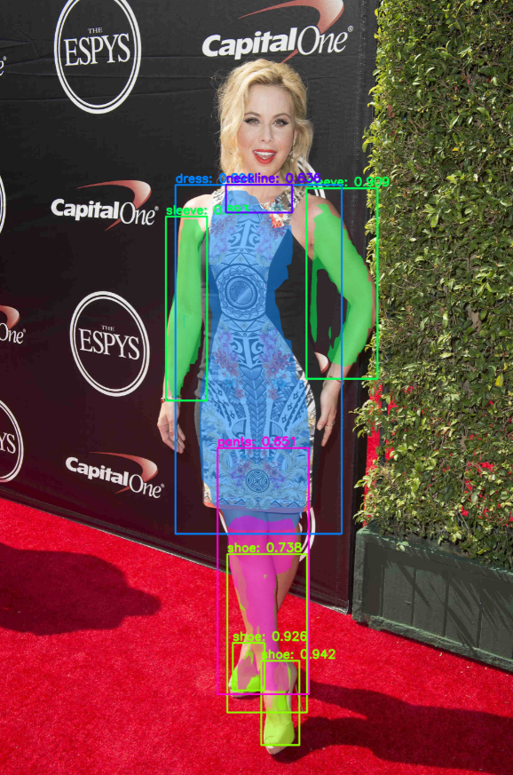

# Fine-Grained Segmentation

This is a project for fine-grained segmentation on clothing items in images, implemented in Python 3, Keras and TensorFlow. A deep learning model generates bounding boxes and segmentation masks for each instance of an object in the image. It's based on [Matterport Mask R-CNN](https://github.com/matterport/Mask_RCNN)



The repository includes:
* Source code of Mask R-CNN 
* Training code to train a model on your own dataset
* Jupyter notebooks to demonstrate object detection / instance segmentation, and to visualize the data pre-processing pipeline and the detection pipeline

## Requirements

Python 3.5, TensorFlow 1.3, Keras 2.0.8 and other common packages listed in `requirements.txt`.

## Installation

1. Clone this repository
2. Install dependencies
   ```bash
   pip3 install -r requirements.txt
   ```
3. Run setup in the Mask_RCNN directory
    ```bash
    python3 Mask_RCNN/setup.py install
    ``` 
4. (Optional) Download pre-trained COCO weights (mask_rcnn_coco.h5) from the Matterport Mask_RCNN [releases page](https://github.com/matterport/Mask_RCNN/releases) and place it in the Mask_RCNN root folder

## Getting Started

* [demo.ipynb](notebooks/demo.ipynb) shows an example of using a trained model to segment clothing items in images.

* [inspect_data.ipynb](notebooks/inspect_data.ipynb) visualizes the different pre-processing steps to prepare the training data.

* [inspect_model.ipynb](notebooks/inspect_model.ipynb) goes in depth into the steps performed to detect and segment objects. It provides visualizations of every step of the pipeline.

* ([model.py](Mask_RCNN/mrcnn/model.py), [utils.py](Mask_RCNN/mrcnn/utils.py), [config.py](Mask_RCNN/mrcnn/config.py)): These files contain the main Mask RCNN implementation. 


